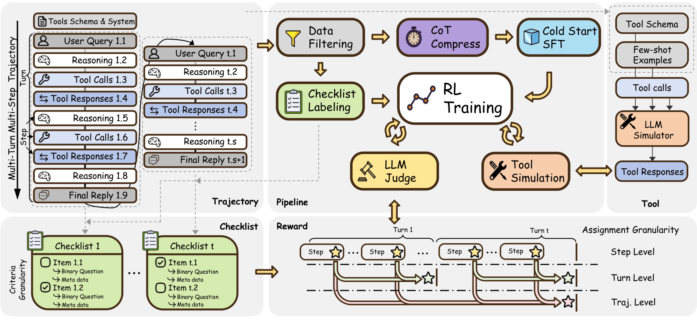

# 🔧CM2: Reinforcement Learning with Checklist Rewards for Multi-Turn and Multi-Step Agentic Tool Use




## 🚀 News
*   **[2026-01-31]** We released the code and paper for CM2.


## Introduction

**CM2** (RL with **C**hecklist Rewards for **M**ulti-Turn and **M**ulti-Step Agentic **Tool** Use) is a Reinforcement Learning framework designed to solve the challenges of training agents for complex, open-ended tool-use scenarios.

Current RL approaches often rely on verifiable rewards (e.g., exact match), which are scarce in realistic multi-turn and multi-step interactions. CM2 introduces **Checklist Rewards**: we decompose an agent's intended behavior into fine-grained, binary, evidence-grounded criteria.

**Key Features:**
*   **Checklist Rewards:** Replaces vague scalar rewards with interpretable, binary checklist items annotated by LLMs.
*   **Sparse Assignment, Dense Criteria:** Adopts a "Sparse in assignment; Dense in criteria" strategy to balance signal informativeness with training stability.
*   **Scalable Tool Environment:** Trains in an LLM-simulated environment capable of handling 5,000+ tools without heavy engineering overhead.
*   **Significant Performance:** Achieves significant improvements over SFT on $\tau^2$-Bench (+8 pts), BFCL-V4 (+10 pts), and ToolSandbox (+12 pts).


## 🛠️ Installation

Follow ``./config_env.sh``.

**Dependencies:**
This project relies on [VeRL](https://github.com/volcengine/verl) for RL training and [LLaMA-Factory](https://github.com/hiyouga/LLaMA-Factory) for SFT.

## 📂🚂 Data Preparation and Training

Follow ``./pipeline/run.sh``.

## 📊 Evaluation

We evaluate CM2 on three major benchmarks: **$\tau^2$-Bench**, **BFCL-V4**, and **ToolSandbox**.

Code for evaluation will be released soon.

## 🙏 Acknowledgement

*   [VeRL](https://github.com/volcengine/verl): For the RL training framework.
*   [LLaMA-Factory](https://github.com/hiyouga/LLaMA-Factory): For the SFT implementation.
*   [Qwen](https://github.com/QwenLM/Qwen): For the powerful base models.


## Citation

If you use this code, please cite our paper:

```bibtex
@misc{zhang2026cm2,
  title={CM2: Reinforcement Learning with Checklist Rewards for Multi-Turn and Multi-Step Agentic Tool Use},
  author={Zhang, Zhen and Song, Kaiqiang and Wang, Xun and Hu, Yebowen and Yan, Weixiang and Zhao, Chenyang and Zou, Henry Peng and Deng, Haoyun and Indurthi, Sathish Reddy and Liu, Shujian and Ma, Simin and Wang, Xiaoyang and Wang, Xin Eric and Wang, Song},
  year={2026},
  howpublished={Preprint},
  url={https://github.com/namezhenzhang/CM2-RLCR-Tool-Agent}
}

```
